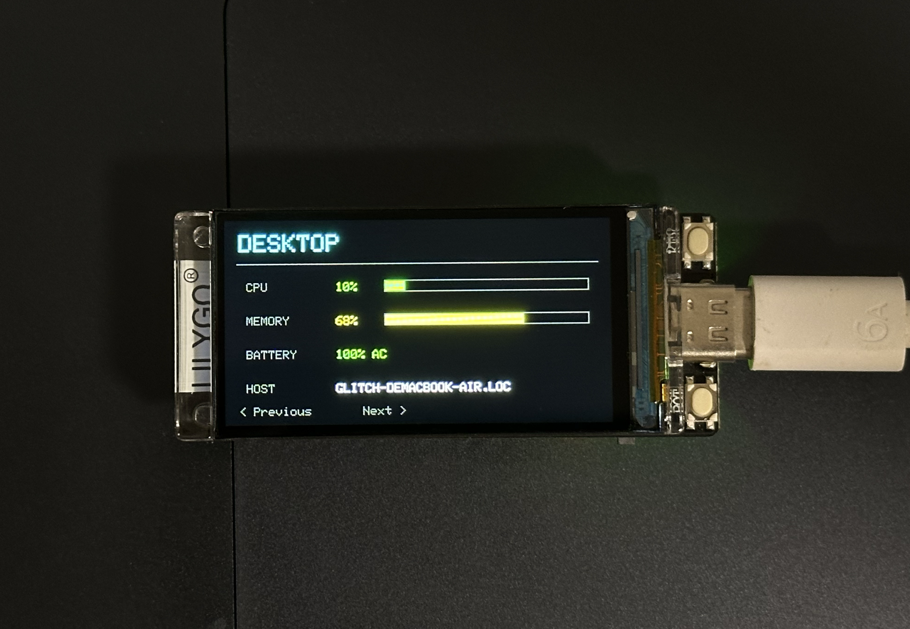
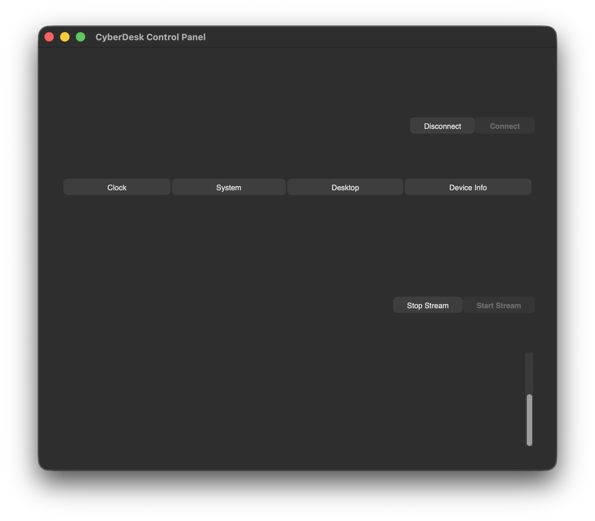
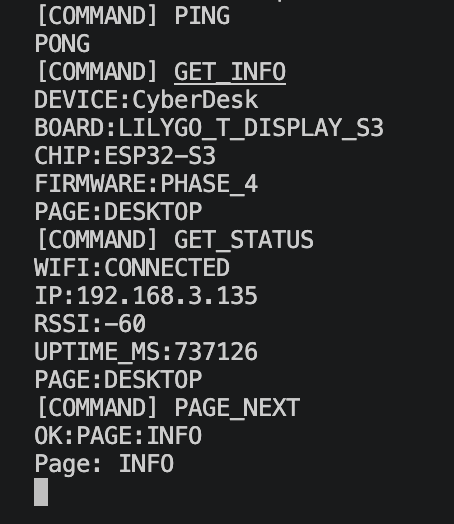

# CyberDesk

CyberDesk is an open-source modular desktop hardware system based on the ESP32-S3.

The project is currently built around the LILYGO T-Display-S3 development board.

## Preview

### Desktop Metrics Dashboard



### Desktop Control Panel



### USB Serial Protocol



## Goals

- Desktop status dashboard
- Custom Stream Deck
- Plugin-based hardware modules
- Web configuration panel
- OTA firmware updates
- Future custom PCB and 3D-printed enclosure

## Hardware

Current development hardware:

- LILYGO T-Display-S3
- ESP32-S3R8
- 16 MB Flash
- 8 MB OPI PSRAM
- 1.9-inch 170 × 320 IPS display
- Two onboard buttons
- USB-C connection

## Current Features

- LILYGO T-Display-S3 support
- Wi-Fi connection with automatic reconnection
- NTP network time synchronization
- Real-time clock and date display
- Local IP address display
- Wi-Fi RSSI signal strength display
- Partial screen refresh to reduce flicker
- Dual-button navigation with software debouncing
- Multi-page user interface
- Clock dashboard page
- System status page with dynamic uptime and network data
- Device information page
- Circular previous/next page navigation
- Local credential configuration excluded from Git
- USB CDC serial communication protocol
- Python-based desktop client
- Automatic CyberDesk serial-port discovery
- Desktop CPU, memory and battery monitoring
- Real-time desktop metrics streaming over USB
- Dedicated desktop metrics dashboard page
- Tkinter desktop control panel
- GUI-based display page navigation
- Start and stop controls for metrics streaming
- Automatic device connection and recovery
- USB disconnection detection and reconnection
- Desktop data timeout and offline-state detection

## Controls

The two onboard buttons are used for page navigation:

- Button 1 (GPIO 0): Previous page
- Button 2 (GPIO 14): Next page

Available pages:

1. Clock
2. System Status
3. Desktop Metrics
4. Device Information

### Serial Commands

| Command | Description |
| --- | --- |
| `PING` | Test the USB serial connection |
| `GET_INFO` | Read device and firmware information |
| `GET_STATUS` | Read Wi-Fi, uptime and current page |
| `PAGE_CLOCK` | Open the clock page |
| `PAGE_SYSTEM` | Open the system page |
| `PAGE_DESKTOP` | Open the desktop metrics page |
| `PAGE_INFO` | Open the device information page |
| `PAGE_NEXT` | Open the next page |
| `PAGE_PREVIOUS` | Open the previous page |
| `DESKTOP_UPDATE\|...` | Send desktop metrics to the device |

## Desktop Application

CyberDesk includes a Python desktop application that communicates with the ESP32-S3 over USB serial.

The desktop application can:

- Automatically discover the connected CyberDesk device
- Display CPU, memory and battery information
- Stream live desktop metrics to the device
- Switch between display pages
- Detect USB disconnection
- Automatically reconnect when the device becomes available again

### Setup

Create and activate a Python virtual environment:

```bash
python3 -m venv desktop/.venv
source desktop/.venv/bin/activate

## Firmware Setup

1. Copy the example credential file:

```bash
cp firmware/include/secrets.example.h firmware/include/secrets.h
```

## Project Structure

```text
CyberDesk/
├── desktop/       # Desktop-side application
├── docs/          # Project documentation
├── firmware/      # ESP32-S3 PlatformIO firmware
├── hardware/      # Schematics, wiring and future PCB files
├── images/        # Project images and screenshots
└── web/           # Web configuration interface
```

## Development Status

- Phase 0: Project initialization — Complete
- Phase 1: Hardware bring-up — Complete
- Phase 2: Network clock dashboard — Complete
- Phase 3: Multi-page UI and button navigation — Complete
- Phase 4: Desktop communication and control panel — Complete
- Phase 5: Modular desktop widgets and plugin architecture — Planned